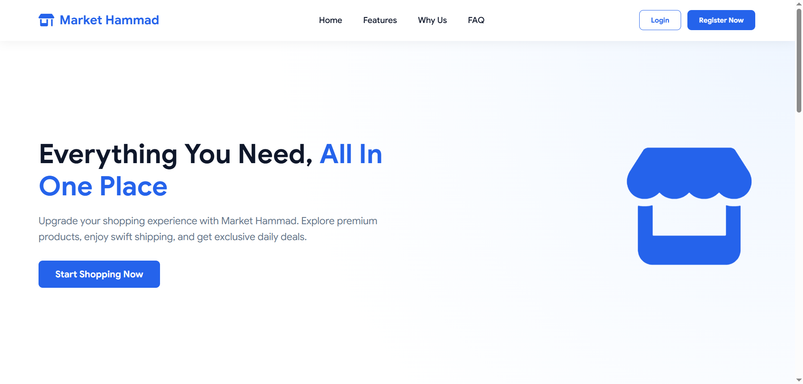
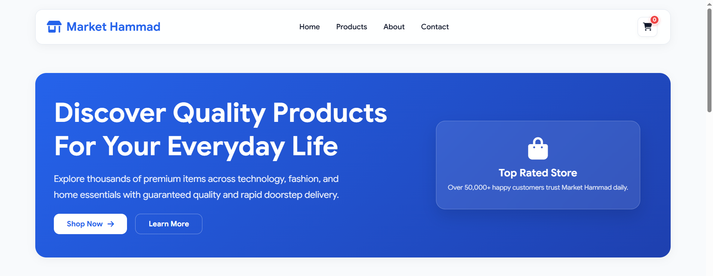
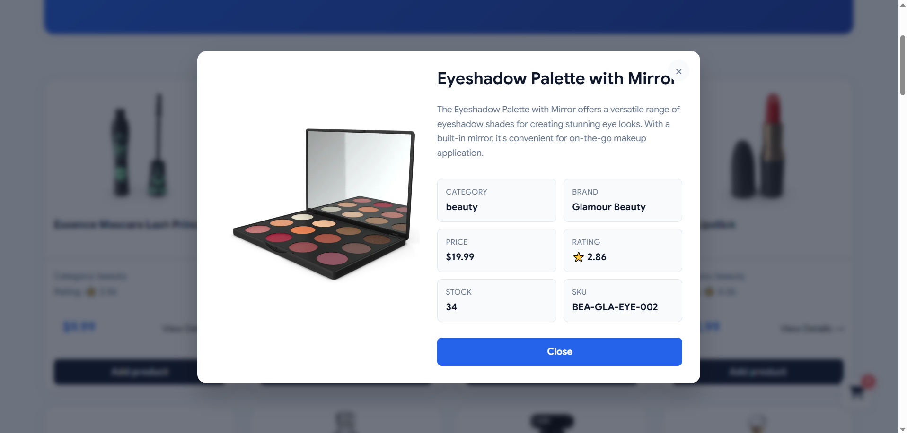
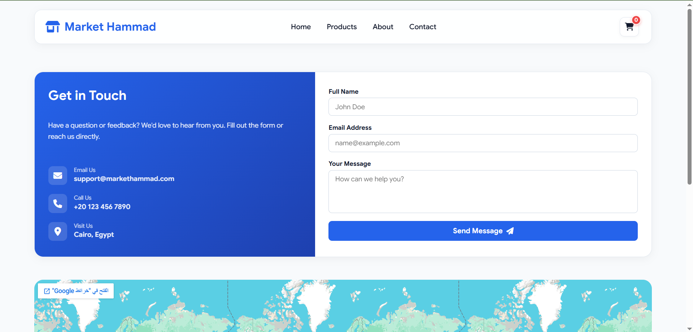
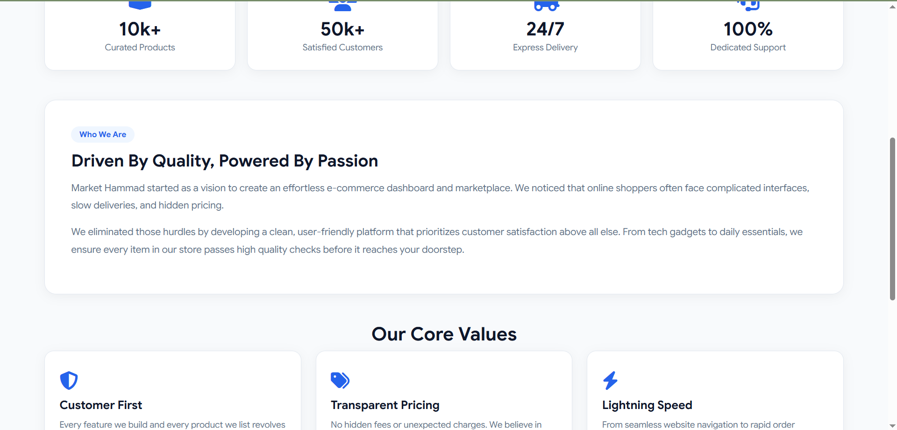

# 🛒 Market Hammad

> A modern and responsive e-commerce website built from scratch using **HTML, CSS, and JavaScript**.

**Market Hammad** is a frontend e-commerce project designed to simulate a real online shopping experience.
The project includes product browsing, categories, search functionality, shopping cart management, authentication forms, and multiple pages with a responsive user interface.

---

## 🚀 Live Demo

🔗 **[View Live Demo →](https://market-hammad.vercel.app/)**

---

## 📸 Project Preview

<div align="center">





<br><br>





<br><br>



</div>


---

## ✨ Features

### 🛍️ Shopping Experience

* Browse products dynamically.
* Search for products by name.
* Filter products by categories.
* View product information.
* Add products to the shopping cart.
* Remove products from the cart.
* Manage cart data using `localStorage`.

### 🔐 Authentication

* Login interface.
* Sign-up interface.
* Login / Sign-up mode switching.
* Form validation.
* User data persistence using `localStorage`.
* Login validation against stored account data.

### 🎨 UI / UX

* Fully responsive layout.
* Modern e-commerce design.
* Smooth transitions and hover effects.
* Fixed navigation header.
* Responsive product cards.
* Responsive shopping cart.
* Clean color system using CSS variables.
* Font Awesome icons.
* Google Sans typography.

### 📄 Pages

* 🏠 Home
* 🛍️ Products
* 🛒 Shopping Cart
* ℹ️ About
* 📩 Contact
* 🔐 Login & Sign Up

---

## 🧰 Technologies Used

| Technology            | Usage                               |
| --------------------- | ----------------------------------- |
| **HTML5**             | Website structure                   |
| **CSS3**              | Styling and responsive design       |
| **JavaScript (ES6+)** | Application logic and interactivity |
| **Fetch API**         | Retrieving product data             |
| **LocalStorage API**  | Saving user and cart data           |
| **Font Awesome**      | Icons                               |
| **Google Fonts**      | Typography                          |

---

## 📁 Project Structure

```text
MarketHammad/
│
├── index.html
│
├── login & signup/
│   ├── login&signup.html
│   ├── style.css
│   └── script.js
│
└── Website/
    │
    ├── Home/
    │   ├── home.html
    │   ├── style.css
    │   └── script.js
    │
    ├── Products/
    │   ├── products.html
    │   ├── style.css
    │   └── js.js
    │
    ├── Shopping Cart/
    │   ├── index.html
    │   ├── style.css
    │   └── js.js
    │── Assets/
    │   ├── Landing-page.png
    │   ├── Home-page.png
    │   ├── Details-card.png
    │   ├── Who-we-are.png
    │   └── Contact-page.png
    ├── About/
    │   ├── about.html
    │   ├── style.css
    │   └── script.js
    │
    └── Contact/
        ├── contact.html
        ├── style.css
        └── script.js
```

---


## 🔄 How It Works

### Product System

Products are retrieved dynamically and displayed as responsive product cards.

The application allows users to:

```text
Fetch Products
      ↓
Display Products
      ↓
Search / Filter
      ↓
Select Products
      ↓
Add to Cart
      ↓
Store Cart Data
```

## 📱 Responsive Design

The interface was designed to work across different screen sizes, including:

* 💻 Desktop
* 💻 Laptop
* 📱 Mobile
* 📟 Tablet

CSS Grid, Flexbox, responsive sizing, and media queries are used to create the responsive layouts.

---

## 🧠 What I Learned

Building this project helped me practice and understand:

* DOM manipulation
* JavaScript events
* Event listeners
* Functions
* Arrays and objects
* `fetch()`
* `async / await`
* Working with APIs
* JSON
* LocalStorage
* Form validation
* Dynamic HTML generation
* Search and filtering
* Shopping cart logic
* Responsive web design
* Multi-page website architecture

---


## 👨‍💻 Author

### Hammad

Frontend Developer in progress 🚀

I'm currently focused on improving my skills in:

* HTML
* CSS
* JavaScript
* Responsive Web Design
* APIs
* Frontend Development

---

## ⭐ Support

If you found this project useful or interesting, consider giving the repository a ⭐ on GitHub.

---

### Built with ❤️ using HTML, CSS & JavaScript
